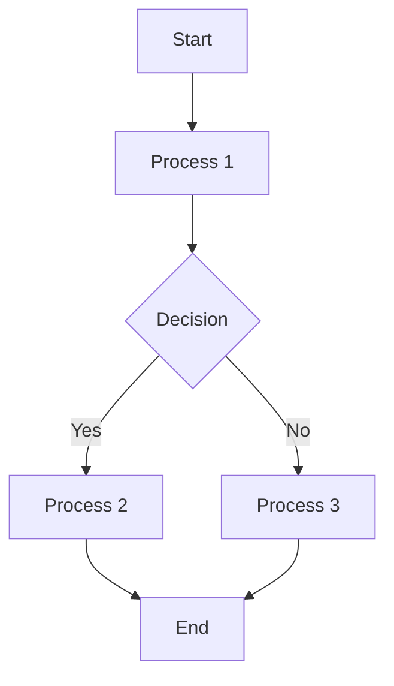

### Demo for PC:

[View demo for PC](https://github.com/user-attachments/assets/b0ad8b7a-3f84-4ab2-b5eb-9cd31243ca07)

### Demo for Mobile:

[View demo for Mobile](https://github.com/user-attachments/assets/9cdc743f-8c26-4151-9588-17ae086692ec)

### About the problem
In Obsidian, when you have a Markdown file with large charts, diagrams, or Mermaid content, these elements may be too large to display fully within the Mermaid window. This plugin is designed to address that issue by allowing you to zoom in, zoom out, and drag the diagrams for better visibility and interaction. Enjoy!

### How to get it
There are three options to install the plugin:

1. **Manual Installation**:
    - Visit the GitHub page of the [plugin](https://github.com/gitcpy/mermaid-zoom-drag) and go to the releases page.
    - Download the latest release files (main.js, manifest.json, styles.css).
    - Create a `Mermaid Zoom Drag` directory in the `./obsidian/plugins/` folder.
    - Move the downloaded files into this directory.
    - Enable the plugin in Obsidian by going to **Settings** -> **Community plugins**.

2. **Using BRAT**:
    - If you have BRAT, copy the link of this plugin.
    - Open BRAT settings, click on `Add Beta Plugin`, paste the link, and press `Add Plugin`.
    - Enable the plugin in **Settings** -> **Community settings**.

3. **From Obsidian Community Plugin Browser**:
    - (TO BE CONTINUED ...)

### What this plugin can do
- The plugin recognizes all diagrams with specific class selectors and adds a control panel for each:
    - **Service panel**: Located at the top right corner.
        - **Hide/Show**: Toggle other subpanels.
        - **Fullscreen mode**: Open or exit fullscreen mode.
        - **Native touch events (Mobile)**: Enable or disable native touch events on the diagram.
    - **Zoom panel**: Positioned at the center of the right edge.
        - **Zoom in**: Increase the scale of the current diagram.
        - **Reset zoom and position**: Reset the scale and position of the diagram.
        - **Zoom out**: Decrease the scale of the current diagram.
    - **Move panel**: Located at the bottom right.
        - Move the diagram in the desired direction.
- **Keyboard shortcuts**:
    - `CTRL` + `+`/`=`: Zoom in.
    - `CTRL` + `-`: Zoom out.
    - `CTRL` + `0`: Reset zoom and position.
    - Arrow keys: Move the diagram.
- **Mouse controls**:
    - Mouse down + drag: Move the diagram.
    - `CTRL` + Mouse Wheel: Zoom in or out.
- The plugin saves zoom and position settings separately for each container, ensuring that each diagram retains its settings.
- **Diagram support**:
    - Supports Mermaid, Mehrmaid (other Mermaid plugins with known issues), PlantUML, and Graphviz.
    - To add support for more diagrams, go to the plugin settings tab. There, you’ll find a 
      brief guide on adding new diagrams.  Just click the extra button next to the `Add new diagram` button for instructions.

### Example

Click the copy button at the top right of the Mermaid diagrams to copy the code and paste it into your Markdown file in Obsidian to see it in action.

### Thanks
- For improving the experiance of Mermaied Diagrams in Obsidian, I set to make a plugin.
- I made a prototype with simple control for PC mainly.
- **Sentiago**
    - The man who has great enthusiasm for development. He added control panel for movement and zooming, touching manipulation, fullscreen mode for better experiance, as well as animation effect. The plugin is much more better.
    - Thanks for his contribution. 

